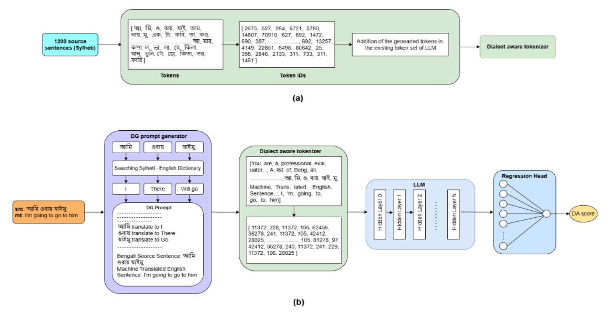
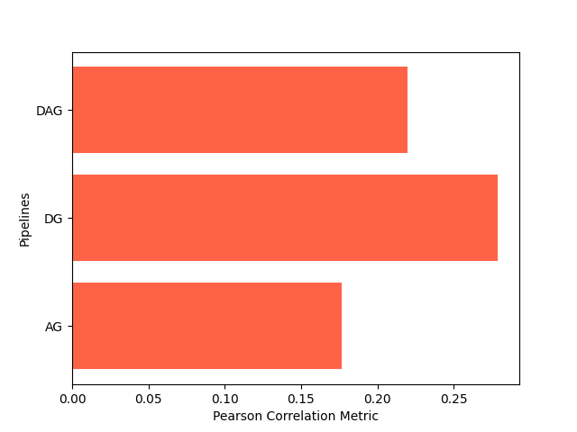

# MTEonLowResourceLanguage
This repo contains the official implementation of our paper: LLM-Based Evaluation of Low-Resource Machine Translation: A Reference-less Dialect Guided Approach with a Refined Sylheti-English Benchmark.

In this paper we introduced,
- Extension of ONUBAD dataset.
- Dialect Aware Tokenizer.
- LLM as frozen backbone.

You will find the overall structure of our propoposed framework in the following figure.



Following graph depicts our proposed framework's (DG) performance in Sylheti-English Benchmark. Here we are using OpenChat as our frozen LLM.



## Enviromental Setup
We used `Ubuntu 22.04` as our OS. Additionally, used conda to create our virtual environment. The full specification of our virtual environment is defined in `environment.yml` and you can easily download and install it by executing the following bash code in your ubuntu terminal.
```bash
git clone https://github.com/180041123-Atiq/MTEonLowResourceLanguage.git
cd FUSED-Net
conda env create -f environment.yml
conda activate llama2-env
```
## Data Processing
The current codebase already includes the train, validation, and test sets for our proposed Sylheti-English Benchmark, so no additional data preprocessing is required. However, if you wish to construct your own benchmark, we have provided a helper script, `dataset.py`, to assist you in doing so.
```
MTEonLowResourceLanguage
|-> dataset.py
|-> train.csv
|-> val.csv
|-> test.csv
.
.
|-> run.sh
```
## Dialtect Aware Tokenizer Initialization
Before fine-tuning your regression head using `allinone.py`, you need to initialize the tokenizer with dialectal context. You can do this by simply executing the following command in your terminal:
```bash
python customTokenizer.py --model llama2 --data train.csv
```
We have implemented support for four LLMs. If you wish to use a different LLM, you may need to add its specifications inside `customTokenizer.py`.
## Training and Evaluation
Create logs and output directories to store training logs and outputs. Once these directories are set up, execute the `run.sh` script. This script will manage the entire fine-tuning and evaluation process of our proposed framework.
```bash
mkdir logs
mkdir output
bash run.sh
```
### Citation
This repository heavily relies on resources from [Hugging Face](https://huggingface.co/) for large language models and the [ONUBAD](https://data.mendeley.com/datasets/6ft99kf89b/2) dataset for creating Sylheti-Englsih machine translation quality evaluation Benchamark.

We extend our sincere gratitude to all contributors who made their resources available as open source — your work significantly supported the development of this research.

If you use this work, please [cite](https://arxiv.org/abs/2505.12273):
```
@article{rahman2025llm,
  title={LLM-Based Evaluation of Low-Resource Machine Translation: A Reference-less Dialect Guided Approach with a Refined Sylheti-English Benchmark},
  author={Rahman, Md Atiqur and Islam, Sabrina and Omi, Mushfiqul Haque},
  journal={arXiv preprint arXiv:2505.12273},
  year={2025}
}
```
